<h1 style="display: flex; align-items: center;">
  orion-ops-pro 是什么
</h1>

`orion-ops-pro`
是一款现代化、高颜值的一站式智能运维管理平台，集资产管理、资产授权、批量执行、计划任务、Web终端、WebSftp、角色管理、系统管理等功能于一体，致力于简化运维团队的治理工作。它是基于 `orion-ops`
的产品思路进行重构，技术架构升级，并优化了交互逻辑，让操作更快捷更友好。

    
	
	
	
			
	<!--  -->	

   

当前版本: **1.0.6**  
github: https://github.com/lijiahangmax/orion-ops-pro  
gitee: https://gitee.com/lijiahangmax/orion-ops-pro  
文档: https://lijiahangmax.gitee.io/orion-ops-pro/#/    
demo: http://101.43.254.243:1081/

演示账号: `admin`    
演示密码: `admin`  
⭐ 体验后可以点一下 `star` 这对我很重要  
📞 合作/功能定制请联系底部 备注: '合作'

## 特性

* 易用便捷: 极简配置, 开箱即用, 支持 Docker 部署方式。
* 资产管理: 支持灵活配置主机分组, 实现对主机、秘钥和身份的统一管理。
* 资产授权: 可将资产数据授权给指定角色和用户, 确保数据安全性。
* 权限控制: 全面管理用户角色, 支持动态菜单配置和强制下线等功能。
* 在线终端: 提供便捷的在线 Web 终端服务, 支持快捷命令、自定义快捷键和主题风格。
* 文件管理: 实现远程主机大文件的批量上传、下载和在线编辑等操作。
* 批量操作: 支持远程主机批量执行 shell 命令。
* 计划任务: 支持配置 cron 表达式, 定时执行主机 shell 命令。
* 操作日志: 记录用户操作日志，确保操作可追溯, 提高系统安全性。
* 可扩展性: 前后端代码规范统一、代码质量高、健壮且易于阅读和扩展。

## 快速开始

docker安装: https://lijiahangmax.gitee.io/orion-ops-pro/#/quickstart/docker-install   
安装文档: https://lijiahangmax.gitee.io/orion-ops-pro/#/quickstart/install   
开发文档: https://lijiahangmax.gitee.io/orion-ops-pro/#/advance/dev   
操作手册: https://lijiahangmax.gitee.io/orion-ops-pro/#/operator/asset  
常见问题: https://lijiahangmax.gitee.io/orion-ops-pro/#/quickstart/faq  
roadmap: https://lijiahangmax.gitee.io/orion-ops-pro/#/about/roadmap

## 技术栈

* Docker
* SpringBoot
* Mysql
* Redis
* Vue3
* Arco Design

## 功能预览

> 工作台

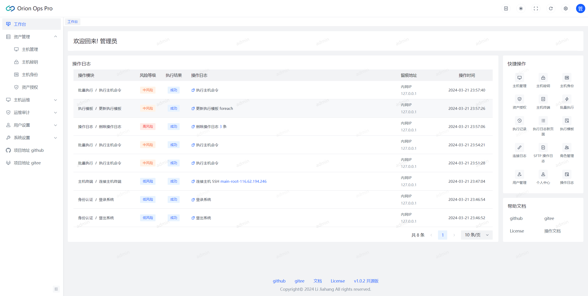

> 资产管理

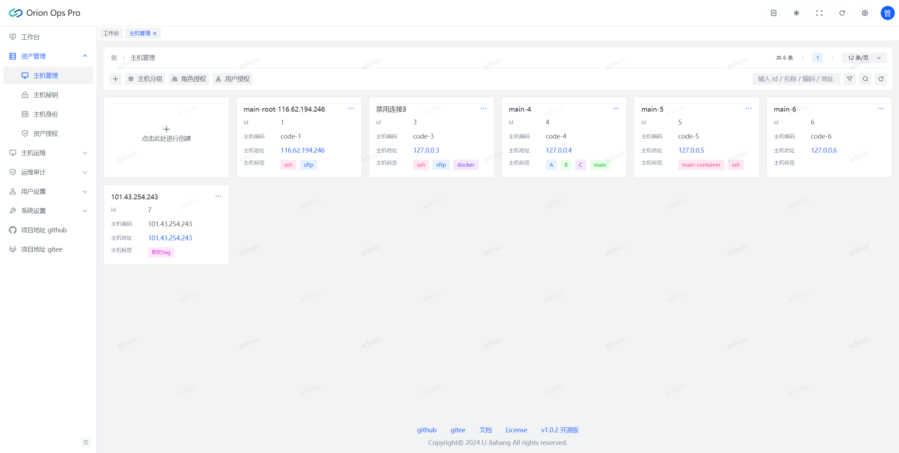
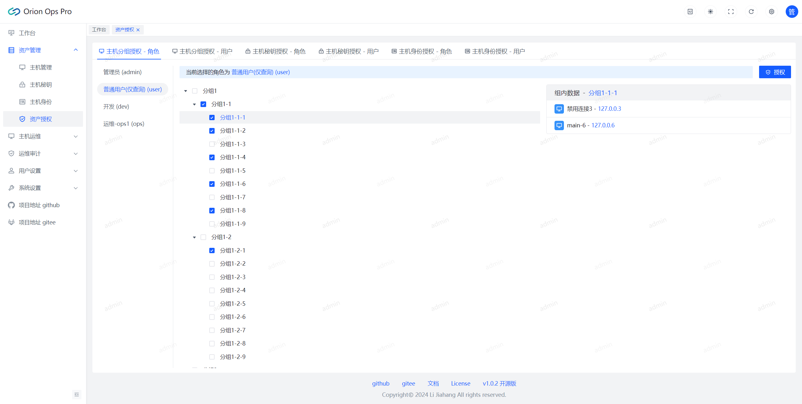

> 主机终端

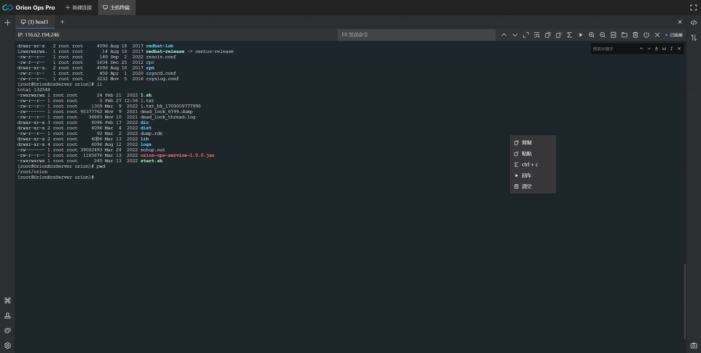
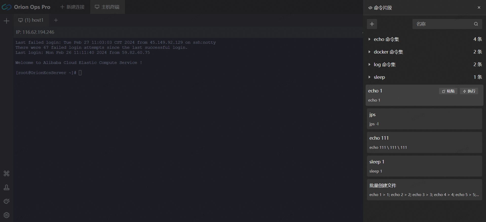
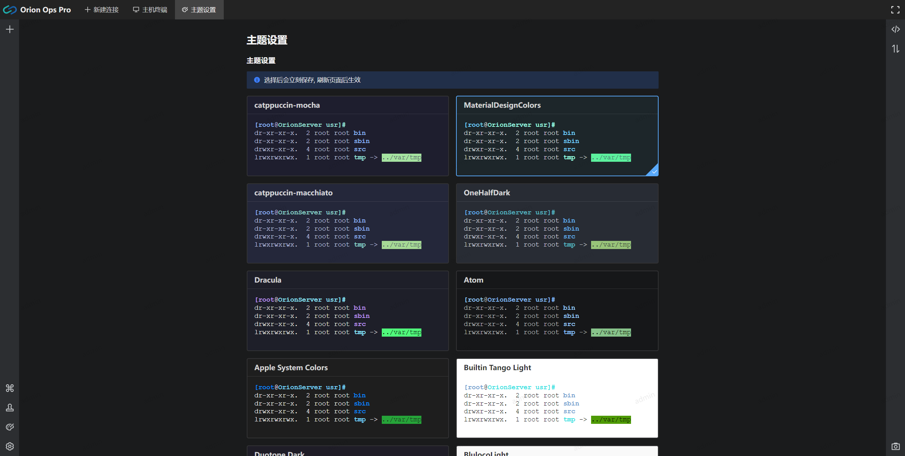
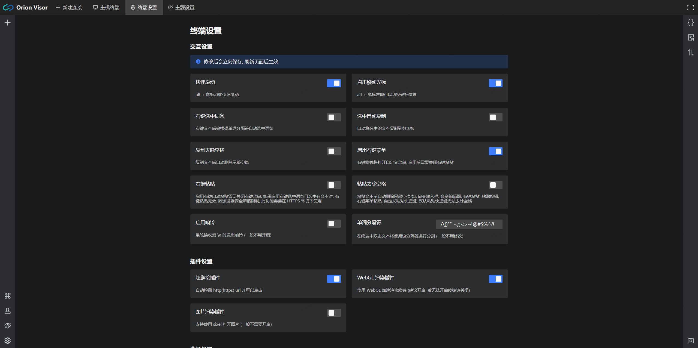
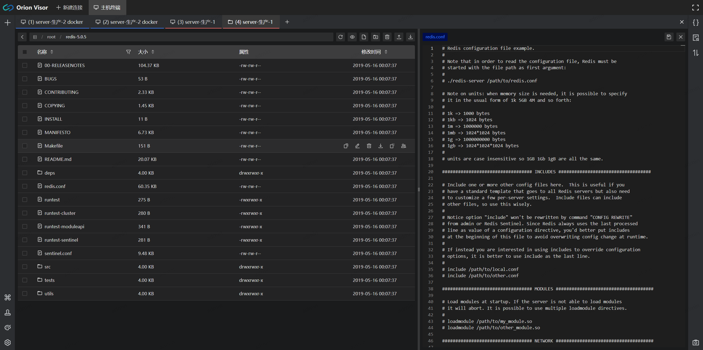
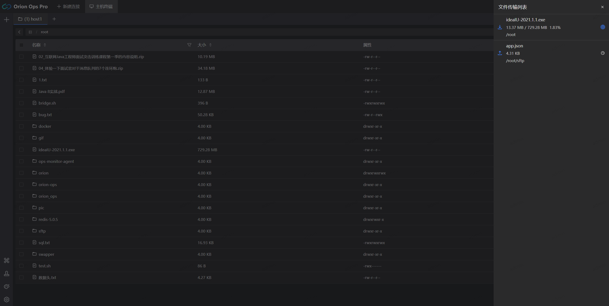

> 批量执行

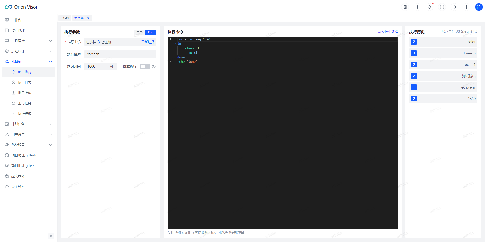
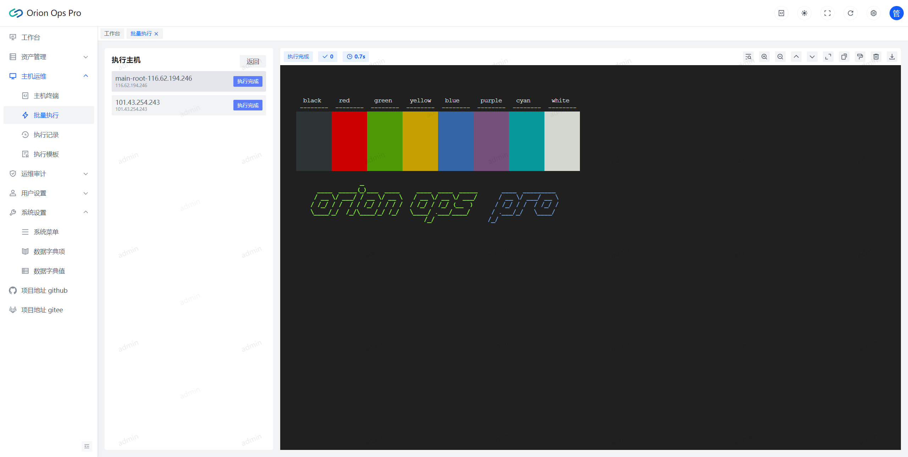
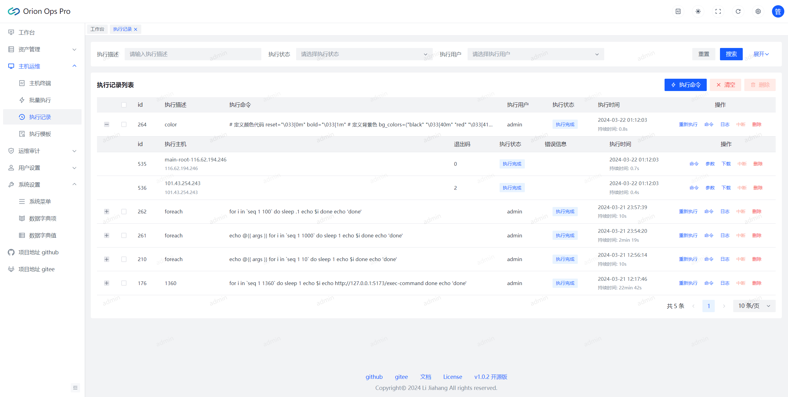

> 计划任务

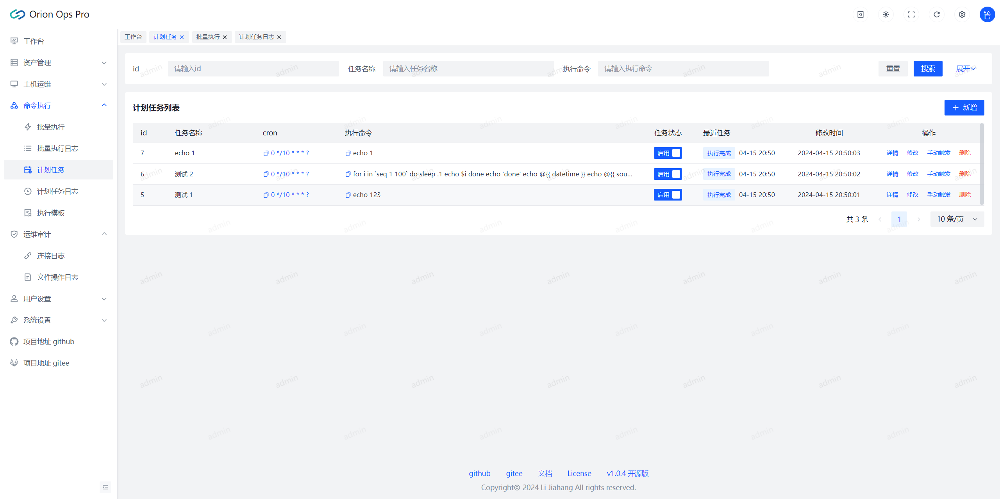
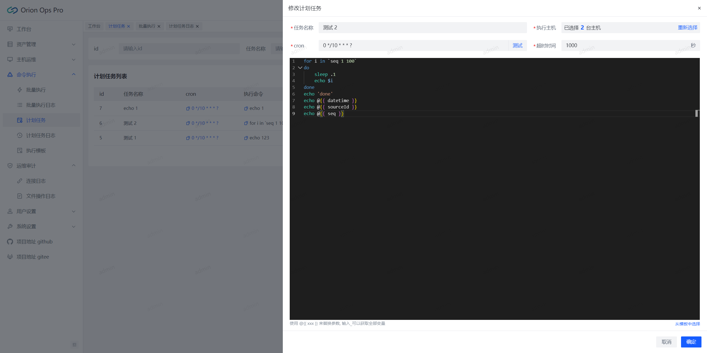
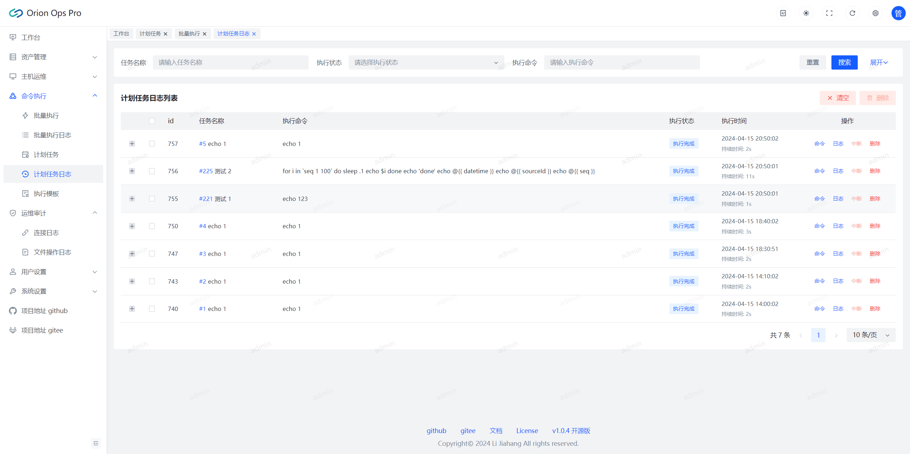

> 用户管理

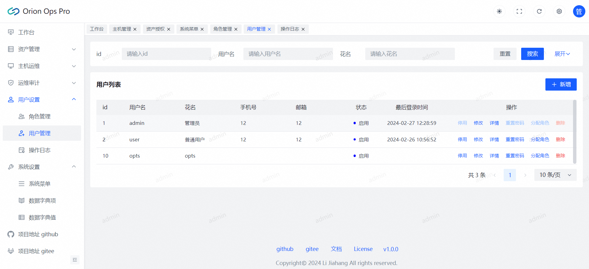  
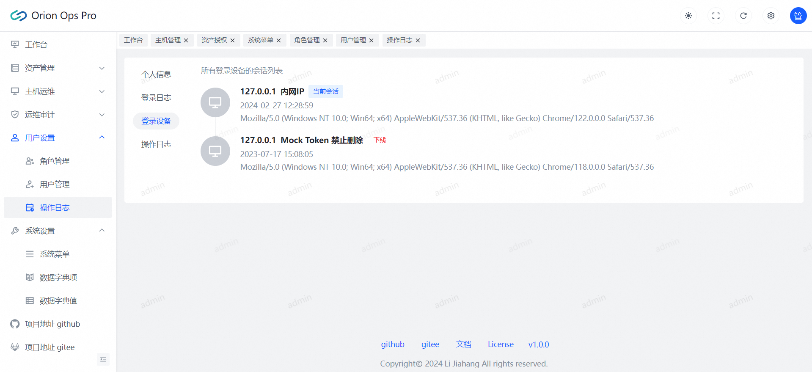
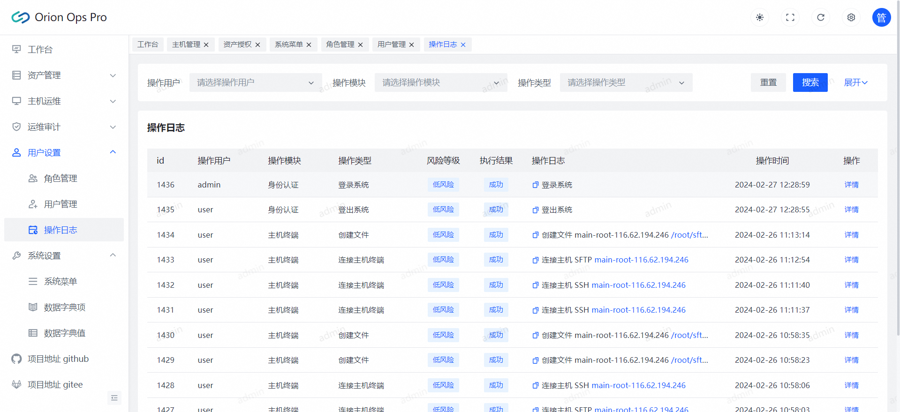

> 系统管理

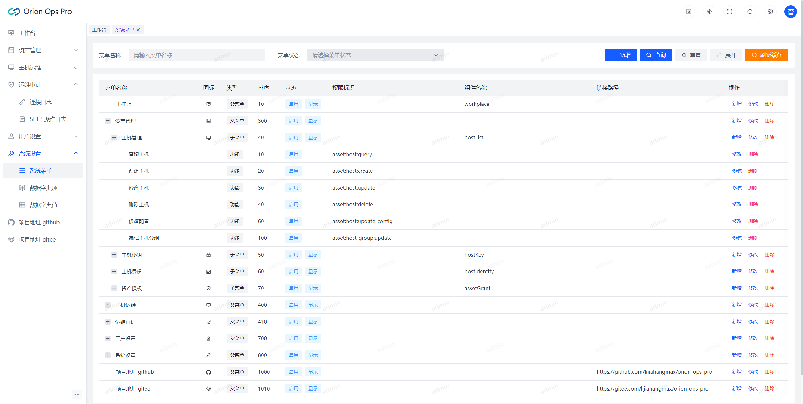  
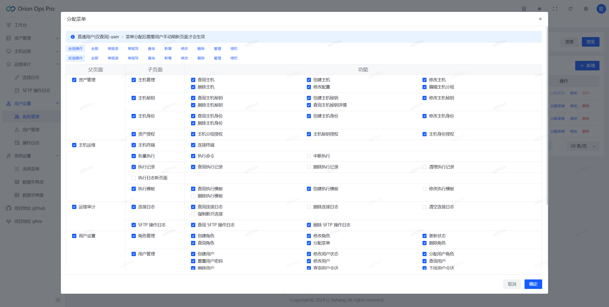

## 联系我

  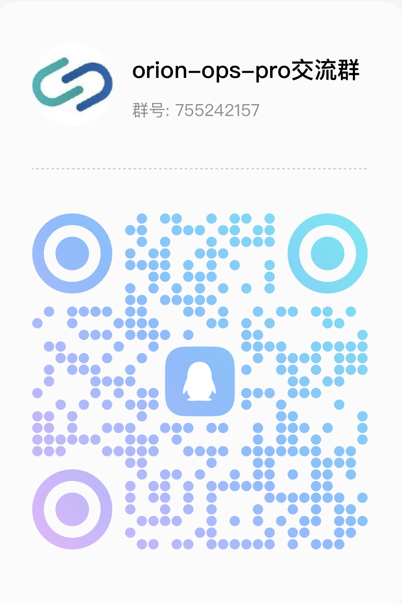  
    

📧 咨询问题微信备注: ops  
📧 合作/功能定制备注: 合作

## 支持一下

  

🎁 为了项目能健康持续的发展, 我期望获得相应的资金支持, 你们的支持是我不断更新前进的动力!

## 免责声明

在使用本项目之前, 请确保您已经了解并同意相关的使用协议和隐私政策。[免责声明](DISCLAIMER.md)

## License

本项目遵循 [Apache-2.0](https://github.com/lijiahangmax/orion-ops-pro/blob/main/LICENSE) 开源许可证。  
